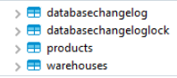
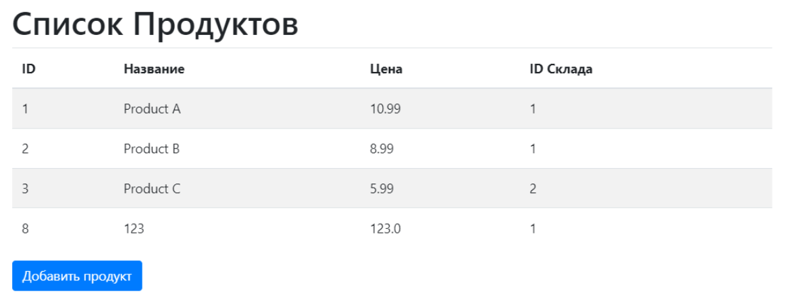
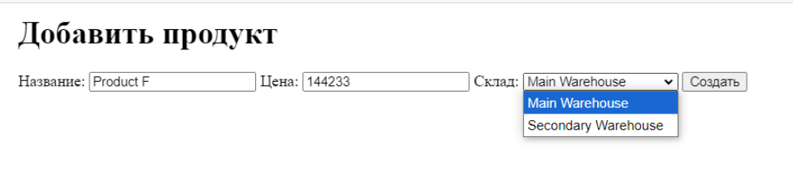
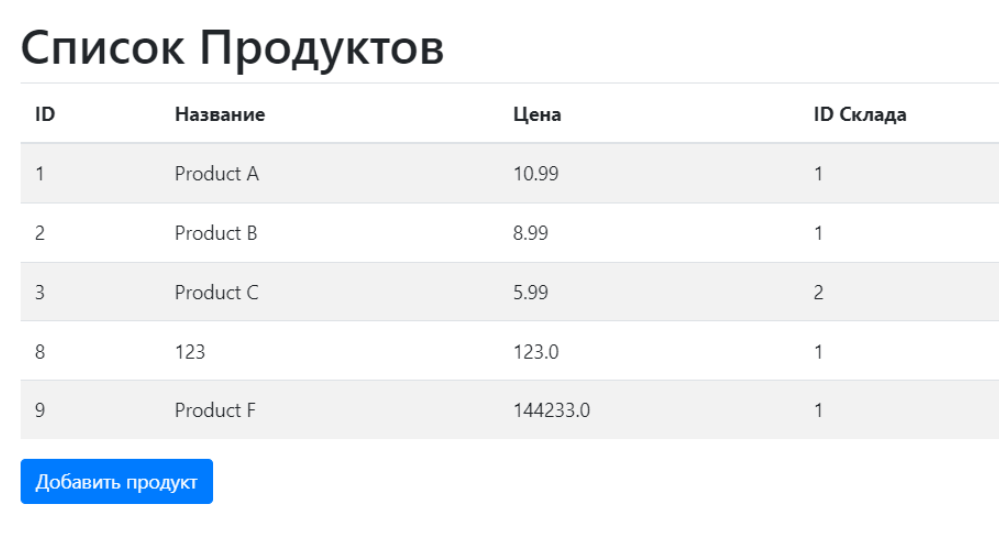
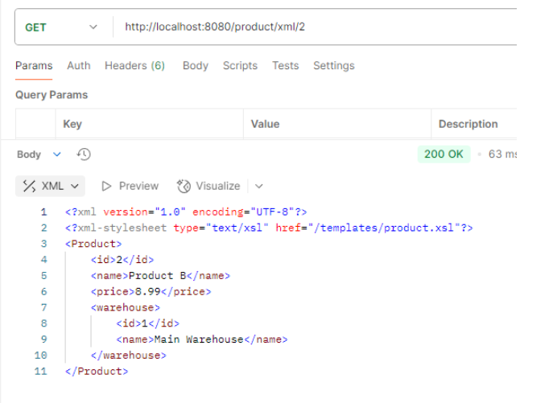
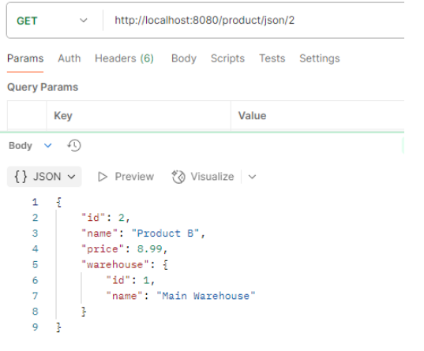
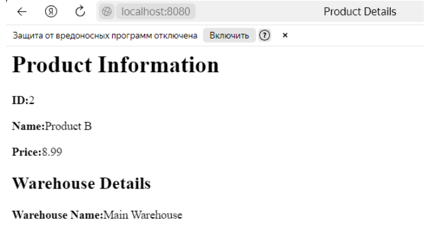
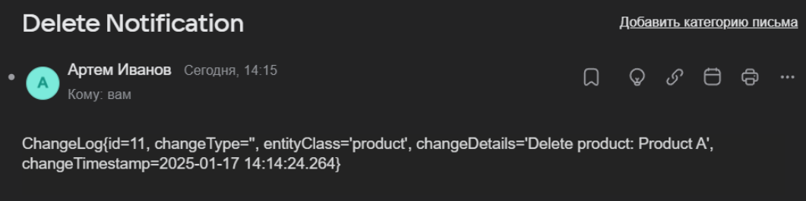

LR2

Для удобства сделал миграции liquibase для создания таблиц и тестовых данных в них

Написан контроллер для отображения шаблонов thymeleaf

создана форма для добавления продукта с выбором склада

Видим что продукт добавлен.

LR 3

Добавлен REST контроллер для работы с json и xml с использованием трансформации XSLT 

На скринах можно увидеть запрос на получения json и xml, а также вывод XSL в браузере

xml

json

xslt

LR 4

Реализована рассылка при изменении сущностей с помощью брокера RabbitMQ, для этого есть таблицы ChangeLog и Notification, 
которые хранят информацию об изменениях и почты для рассылки

вот пример письма при удалении продукта

